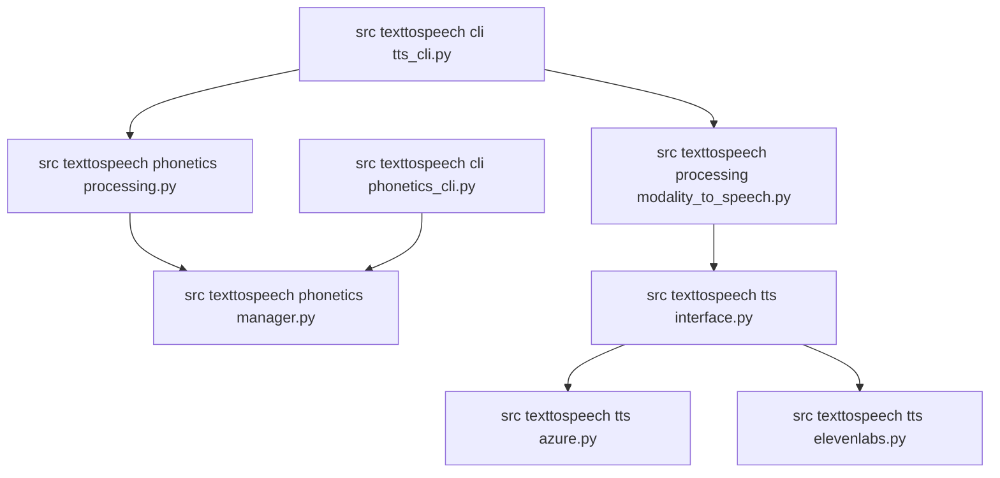

# Repository Reorganization Plan 

Summary and goals
- Consolidate code into src/texttospeech package without packaging (no pyproject.toml).
- Keep requirements.txt and requirements_phonetic.txt.
- Single top-level .gitignore.
- Introduce general and personal phonetic lookup files with overlay.
- Add a Phonetic Processing Module skeleton used by both CLIs later.

Decisions (agreed)
- Package layout: src-based, run via python -m.
- No console scripts or pyproject.toml.
- Data policy: track data/phonetic_lookup.json, gitignore data/phonetic_lookup.personal.json.
- Two CLIs: tts and phonetics remain, refactored under src/texttospeech/cli.

Target directory structure

```
src/
  texttospeech/
    __init__.py
    cli/
      __init__.py
      tts_cli.py
      phonetics_cli.py
    tts/
      __init__.py
      interface.py
      azure.py
      elevenlabs.py
    processing/
      __init__.py
      modality_to_speech.py
      markdown_parser.py
      ppt_processor.py
    phonetics/
      __init__.py
      manager.py
      processing.py
      llm_coach.py
examples/
  sample.md
  sample.pptx
  output/
tests/
config/
  config.sample.yaml
  config.yaml (gitignored)
data/
  phonetic_lookup.json
  phonetic_lookup.personal.json (gitignored)
temp/ (gitignored)
docs/
legacy/
```

File mapping from current repository
- [`main.py`](../main.py) → [`src/texttospeech/cli/tts_cli.py`](../src/texttospeech/cli/tts_cli.py)
- [`cli_phonetic_word_manager.py`](../cli_phonetic_word_manager.py) → [`src/texttospeech/cli/phonetics_cli.py`](../src/texttospeech/cli/phonetics_cli.py)
- [`tts_interface.py`](../tts_interface.py) → [`src/texttospeech/tts/interface.py`](../src/texttospeech/tts/interface.py)
- [`tts_azure.py`](../tts_azure.py) → [`src/texttospeech/tts/azure.py`](../src/texttospeech/tts/azure.py)
- [`tts_elevenlabs.py`](../tts_elevenlabs.py) → [`src/texttospeech/tts/elevenlabs.py`](../src/texttospeech/tts/elevenlabs.py)
- [`modality_to_speech.py`](../modality_to_speech.py) → [`src/texttospeech/processing/modality_to_speech.py`](../src/texttospeech/processing/modality_to_speech.py)
- [`markdown_parser.py`](../markdown_parser.py) → [`src/texttospeech/processing/markdown_parser.py`](../src/texttospeech/processing/markdown_parser.py)
- [`ppt_processor.py`](../ppt_processor.py) → [`src/texttospeech/processing/ppt_processor.py`](../src/texttospeech/processing/ppt_processor.py)
- [`phonetic_word_manager.py`](../phonetic_word_manager.py) → [`src/texttospeech/phonetics/manager.py`](../src/texttospeech/phonetics/manager.py)
- [`llm_phonetic_coach.py`](../llm_phonetic_coach.py) → [`src/texttospeech/phonetics/llm_coach.py`](../src/texttospeech/phonetics/llm_coach.py)
- [`README.md`](../README.md) → [`docs/README.md`](../docs/README.md)
- [`README_phonetic.md`](../README_phonetic.md) → [`docs/README_phonetic.md`](../docs/README_phonetic.md)
- [`config_sample.yaml`](../config_sample.yaml) → [`config/config.sample.yaml`](../config/config.sample.yaml)
- [`phonetic_lookup.json`](../phonetic_lookup.json) → [`data/phonetic_lookup.json`](../data/phonetic_lookup.json)
- [`Input/sample.pptx`](../Input/sample.pptx) → [`examples/sample.pptx`](../examples/sample.pptx)
- [`Input/sample/sample.md`](../Input/sample/sample.md) → [`examples/sample.md`](../examples/sample.md)
- [`Input/sample/*.mp3`](../Input/sample/) → [`examples/output/`](../examples/output/)
- Temp wavs: [`minimal_test_*.wav`](../) [`test_recording_*.wav`](../) [`tts_test.wav`](../) → [`temp/`](../temp/)
- Legacy backups: [`cli_phonetic_word_manager_backup.py.old`](../cli_phonetic_word_manager_backup.py.old), [`llm_phonetic_coach.py.old`](../llm_phonetic_coach.py.old) → [`legacy/`](../legacy/)
- Tests: [`test_azure_tts.py`](../test_azure_tts.py), [`test_tts.py`](../test_tts.py), [`test_llm_coach.py`](../test_llm_coach.py) → [`tests/`](../tests/)

Phonetic Processing Module (design only)
- Location: [`src/texttospeech/phonetics/processing.py`](../src/texttospeech/phonetics/processing.py)
- Responsibilities:
  - Validate IPA or other notation and normalize.
  - Generate backend-appropriate markup:
    - Azure: SSML with <phoneme alphabet="ipa" ph="...">word</phoneme>.
    - ElevenLabs: inline hints (e.g., word (IPA)) until native support.
  - Parse project-specific markup in text and apply lookups.
- Proposed API:
  - [`PhoneticProcessor.__init__()`](../src/texttospeech/phonetics/processing.py:1) configured with backend and accepts_ssml.
  - [`PhoneticProcessor.preprocess_text()`](../src/texttospeech/phonetics/processing.py:1) → (is_ssml, processed_text).
- Integration:
  - tts_cli initializes PhoneticProcessor; passes to modality_to_speech.
  - modality_to_speech uses it per section prior to calling backend.
  - phonetics_cli may use it for preview/validation.

Phonetic lookup overlay policy
- General tracked file: [`data/phonetic_lookup.json`](../data/phonetic_lookup.json).
- Personal gitignored file: [`data/phonetic_lookup.personal.json`](../data/phonetic_lookup.personal.json).
- Load general, then overlay personal at runtime in [`src/texttospeech/phonetics/manager.py`](../src/texttospeech/phonetics/manager.py).

Execution phases and steps

Phase 0 — Plan artifact
- Write this plan to tasks/reorg-plan.md. Track changes as we proceed.

Phase 1 — Scaffolding
- Create directories under src/texttospeech and add __init__.py.
- Create placeholders for cli/tts_cli.py, cli/phonetics_cli.py, phonetics/processing.py.
- Create examples/, data/, config/, temp/, docs/, tests/, legacy/.
- Append ignore entries to top-level [.gitignore](../.gitignore):
  - config/config.yaml
  - data/phonetic_lookup.personal.json
  - temp/
  - examples/output/
  - *.wav
  - .venv/
  - __pycache__/

Phase 2 — Move files
- Move modules to their mapped destinations (see mapping).
- Move Input samples to examples/, media to examples/output/.
- Move temp wavs to temp/.
- Move legacy backups to legacy/.
- Move config_sample.yaml to config/config.sample.yaml.

Phase 3 — Import updates
- Update all imports to src/texttospeech paths:
  - from tts_azure import AzureTTS → from texttospeech.tts.azure import AzureTTS
  - from tts_elevenlabs import ElevenLabsTTS → from texttospeech.tts.elevenlabs import ElevenLabsTTS
  - from modality_to_speech import ModalityToSpeech → from texttospeech.processing.modality_to_speech import ModalityToSpeech
  - from llm_phonetic_coach import LLMPhoneticCoach → from texttospeech.phonetics.llm_coach import LLMPhoneticCoach
- Ensure relative runtime paths for examples/, data/, config/ are correct.

Phase 4 — CLI refactor
- Refactor [`main.py`](../main.py) into [`src/texttospeech/cli/tts_cli.py`](../src/texttospeech/cli/tts_cli.py).
- Refactor [`cli_phonetic_word_manager.py`](../cli_phonetic_word_manager.py) into [`src/texttospeech/cli/phonetics_cli.py`](../src/texttospeech/cli/phonetics_cli.py).
- Keep legacy files temporarily to aid testing; remove later.

Phase 5 — Phonetic manager overlay
- Modify [`src/texttospeech/phonetics/manager.py`](../src/texttospeech/phonetics/manager.py) to:
  - Load data/phonetic_lookup.json.
  - If present, load data/phonetic_lookup.personal.json and overlay entries by key.
  - Save behavior: default writes to personal file; allow explicit target.

Phase 6 — Optional interface touchpoints
- Add a capability flag on backends via [`src/texttospeech/tts/interface.py`](../src/texttospeech/tts/interface.py) (accepts_ssml) for processor decisions.
- Wire optional PhoneticProcessor into [`src/texttospeech/processing/modality_to_speech.py`](../src/texttospeech/processing/modality_to_speech.py) method signatures (no behavior change yet).

Phase 7 — Tests and verification
- Update tests under [`tests/`](../tests/) to import from texttospeech.*.
- Add/adjust fixtures for examples/ and data/.
- Manual verification:
  - Run: python -m texttospeech.cli.tts_cli --help
  - Run: python -m texttospeech.cli.phonetics_cli --help
  - Verify voices listing, MD and PPT processing, and phonetics manager flows.

Phase 8 — Documentation
- Move docs to [`docs/`](../docs/) and update links/commands to new structure.
- Document lookup overlay behavior and where files live.

Safety and rollback
- All file moves are mechanical; commits after each phase.
- Keep legacy files under [`legacy/`](../legacy/) until verification completes.

Verification checklist (must do)
- For each file in src/texttospeech:
  - Validate library import paths.
  - Check input paths (examples/, config/).
  - Check output paths (examples/output/, temp/).
  - Check data load/save locations (data/phonetic_lookup*.json).
- For CLIs:
  - Ensure argparse and help messages reflect new paths and defaults.
  - Ensure interactive flows still function.
- For docs:
  - All code blocks and file paths updated.

Run commands (after reorg)
- Voices (example): python -m texttospeech.cli.tts_cli --voices
- Markdown: python -m texttospeech.cli.tts_cli --md examples/sample.md "VoiceName"
- PowerPoint: python -m texttospeech.cli.tts_cli --ppt examples/sample.pptx "VoiceName"
- Phonetics: python -m texttospeech.cli.phonetics_cli --interactive


Appendix: module diagram (Mermaid)


Change log
- v1: Initial plan captured and approved for execution.
## Incremental execution plan with checkpoints

Goal
- Minimize downtime by migrating in small, testable steps.
- Keep legacy entry points working until the very end.
- Insert explicit checkpoints where the code should run and be validated before proceeding.

Notation
- Windows PowerShell examples are shown. On other shells adjust environment variable syntax accordingly.
- During transition, we will keep legacy root modules as shim files so existing CLIs continue to function.

Pre-migration baseline (Checkpoint 0)
- Verify current setup works end-to-end before any changes.
- Commands:
  - Install dependencies
    - PowerShell:
      ```
      pip install -r requirements.txt
      pip install -r requirements_phonetic.txt
      ```
  - Run legacy CLIs to confirm baseline behavior
    - TTS:
      ```
      python main.py --help
      ```
    - Phonetics:
      ```
      python cli_phonetic_word_manager.py --help
      ```
  - Optional smoke tests (these should not throw exceptions):
    - Voices listing (no credentials will still show helpful errors, but the CLI should parse flags):
      ```
      python main.py --voices-short
      ```
    - Phonetics CLI usage:
      ```
      python cli_phonetic_word_manager.py --devices-common
      ```

Phase 1 — Create src skeleton only (Checkpoint 1)
- Create package dirs and empty __init__.py files under:
  - [`src/texttospeech/__init__.py`](../src/texttospeech/__init__.py)
  - [`src/texttospeech/cli/__init__.py`](../src/texttospeech/cli/__init__.py)
  - [`src/texttospeech/tts/__init__.py`](../src/texttospeech/tts/__init__.py)
  - [`src/texttospeech/processing/__init__.py`](../src/texttospeech/processing/__init__.py)
  - [`src/texttospeech/phonetics/__init__.py`](../src/texttospeech/phonetics/__init__.py)
- Add two CLI stubs that only print a message:
  - [`src/texttospeech/cli/tts_cli.py`](../src/texttospeech/cli/tts_cli.py)
  - [`src/texttospeech/cli/phonetics_cli.py`](../src/texttospeech/cli/phonetics_cli.py)
- Add a design-only skeleton for the phonetic processing module:
  - [`src/texttospeech/phonetics/processing.py`](../src/texttospeech/phonetics/processing.py)
- Checkpoint 1 test:
  - Verify the stubs can import and run (no packaging used; prepend src to sys.path at runtime):
    ```
    python -c "import sys; sys.path.insert(0, 'src'); import texttospeech.cli.tts_cli as t; t.main()"
    python -c "import sys; sys.path.insert(0, 'src'); import texttospeech.cli.phonetics_cli as p; p.main()"
    ```
  - Legacy entry points must still work unchanged:
    ```
    python main.py --help
    python cli_phonetic_word_manager.py --help
    ```

Phase 2 — Move TTS libraries into src (Checkpoint 2)
- Move these files and update new package filenames:
  - [`tts_interface.py`](../tts_interface.py) → [`src/texttospeech/tts/interface.py`](../src/texttospeech/tts/interface.py)
  - [`tts_azure.py`](../tts_azure.py) → [`src/texttospeech/tts/azure.py`](../src/texttospeech/tts/azure.py)
  - [`tts_elevenlabs.py`](../tts_elevenlabs.py) → [`src/texttospeech/tts/elevenlabs.py`](../src/texttospeech/tts/elevenlabs.py)
- Create compatibility shim files at project root (temporary):
  - Keep filenames the same at root and make each do:
    - Example in [`tts_azure.py`](../tts_azure.py:1): 
      ```
      from texttospeech.tts.azure import *
      ```
    - Repeat similarly for [`tts_interface.py`](../tts_interface.py:1) and [`tts_elevenlabs.py`](../tts_elevenlabs.py:1).
- Checkpoint 2 test:
  - Existing CLI should continue to run without import errors:
    ```
    python main.py --help
    ```
  - Verify the new import path is valid:
    ```
    python -c "import sys; sys.path.insert(0, 'src'); from texttospeech.tts.azure import AzureTTS; print('AzureTTS OK')"
    ```

Phase 3 — Move processing libraries (Checkpoint 3)
- Move these files:
  - [`modality_to_speech.py`](../modality_to_speech.py) → [`src/texttospeech/processing/modality_to_speech.py`](../src/texttospeech/processing/modality_to_speech.py)
  - [`markdown_parser.py`](../markdown_parser.py) → [`src/texttospeech/processing/markdown_parser.py`](../src/texttospeech/processing/markdown_parser.py)
  - [`ppt_processor.py`](../ppt_processor.py) → [`src/texttospeech/processing/ppt_processor.py`](../src/texttospeech/processing/ppt_processor.py)
- Add root shims (temporary):
  - Example in [`modality_to_speech.py`](../modality_to_speech.py:1):
    ```
    from texttospeech.processing.modality_to_speech import *
    ```
  - Do similarly for [`markdown_parser.py`](../markdown_parser.py:1) and [`ppt_processor.py`](../ppt_processor.py:1).
- Checkpoint 3 test:
  - Baseline TTS CLI still works:
    ```
    python main.py --help
    ```
  - Simple Markdown pipeline smoke check (path may vary; this verifies imports wire up):
    ```
    python main.py --md Input\sample\sample.md --overwrite-audio
    ```
    Expect either generation or a clear config error; no ImportError/ModuleNotFoundError.

Phase 4 — Move phonetics libraries (Checkpoint 4)
- Move:
  - [`phonetic_word_manager.py`](../phonetic_word_manager.py) → [`src/texttospeech/phonetics/manager.py`](../src/texttospeech/phonetics/manager.py)
  - [`llm_phonetic_coach.py`](../llm_phonetic_coach.py) → [`src/texttospeech/phonetics/llm_coach.py`](../src/texttospeech/phonetics/llm_coach.py)
- Add root shims (temporary) to maintain CLI compatibility:
  - [`phonetic_word_manager.py`](../phonetic_word_manager.py:1):
    ```
    from texttospeech.phonetics.manager import *
    ```
  - [`llm_phonetic_coach.py`](../llm_phonetic_coach.py:1):
    ```
    from texttospeech.phonetics.llm_coach import *
    ```
- Checkpoint 4 test:
  - Phonetics CLI still runs:
    ```
    python cli_phonetic_word_manager.py --help
    ```
  - Optional: list pronunciations (should not throw import errors):
    ```
    python cli_phonetic_word_manager.py --list
    ```

Phase 5 — Implement general + personal lookup overlay (Checkpoint 5)
- Update [`src/texttospeech/phonetics/manager.py`](../src/texttospeech/phonetics/manager.py) to:
  - Load [`data/phonetic_lookup.json`](../data/phonetic_lookup.json) first (tracked general).
  - If exists, load [`data/phonetic_lookup.personal.json`](../data/phonetic_lookup.personal.json) (gitignored) and overlay entries (personal wins per key).
  - Default saves should target the personal file to avoid committing personal data by mistake.
- Checkpoint 5 test:
  - Create a small general lookup JSON with one entry (tracked).
  - Create a personal JSON overriding the same word and adding another.
  - Verify overlay via:
    ```
    python -c "import sys, json; sys.path.insert(0, 'src'); from texttospeech.phonetics.manager import PhoneticLookupManager as M; m=M('data/phonetic_lookup.personal.json'); print('Entries:', len(m.pronunciations))"
    ```
  - Run:
    ```
    python cli_phonetic_word_manager.py --list
    ```
    Confirm merged view.

Phase 6 — Refactor TTS CLI (Checkpoint 6)
- Port logic from [`main.py`](../main.py) to [`src/texttospeech/cli/tts_cli.py`](../src/texttospeech/cli/tts_cli.py).
- Keep [`main.py`](../main.py) intact for now.
- Use package imports in the new CLI:
  - from texttospeech.tts.azure import AzureTTS
  - from texttospeech.tts.elevenlabs import ElevenLabsTTS
  - from texttospeech.processing.modality_to_speech import ModalityToSpeech
- Checkpoint 6 test:
  - Verify new CLI entry point works via python -m:
    ```
    python -c "import sys; sys.path.insert(0, 'src'); import texttospeech.cli.tts_cli as t; t.main()"
    ```
  - Legacy entry still works:
    ```
    python main.py --help
    ```

Phase 7 — Refactor Phonetics CLI (Checkpoint 7)
- Port CLI surface from [`cli_phonetic_word_manager.py`](../cli_phonetic_word_manager.py) to [`src/texttospeech/cli/phonetics_cli.py`](../src/texttospeech/cli/phonetics_cli.py).
- Use:
  - from texttospeech.phonetics.manager import InteractivePhoneticManager
- Checkpoint 7 test:
  - Verify new CLI via python -m:
    ```
    python -c "import sys; sys.path.insert(0, 'src'); import texttospeech.cli.phonetics_cli as p; p.main()"
    ```
  - Legacy entry still works:
    ```
    python cli_phonetic_word_manager.py --help
    ```

Phase 8 — Wire optional PhoneticProcessor (no behavior change) (Checkpoint 8)
- Add optional parameter to [`src/texttospeech/processing/modality_to_speech.py`](../src/texttospeech/processing/modality_to_speech.py) methods to accept a processor instance (default None) and pass-through text unchanged for now.
- Use it in [`src/texttospeech/cli/tts_cli.py`](../src/texttospeech/cli/tts_cli.py) to initialize a processor with the selected backend and feed it to the pipeline (but still no logic).
- Checkpoint 8 test:
  - Re-run basic TTS flows; behavior should be unchanged.

Phase 9 — Remove shims and update imports (Checkpoint 9)
- After all callers use texttospeech.* imports:
  - Remove shim bodies or delete root shim files:
    - [`tts_interface.py`](../tts_interface.py), [`tts_azure.py`](../tts_azure.py), [`tts_elevenlabs.py`](../tts_elevenlabs.py)
    - [`modality_to_speech.py`](../modality_to_speech.py), [`markdown_parser.py`](../markdown_parser.py), [`ppt_processor.py`](../ppt_processor.py)
    - [`phonetic_word_manager.py`](../phonetic_word_manager.py), [`llm_phonetic_coach.py`](../llm_phonetic_coach.py)
- Checkpoint 9 test:
  - Ensure both new CLIs work:
    ```
    python -c "import sys; sys.path.insert(0, 'src'); import texttospeech.cli.tts_cli as t; t.main()"
    python -c "import sys; sys.path.insert(0, 'src'); import texttospeech.cli.phonetics_cli as p; p.main()"
    ```
  - Legacy entry points can be deprecated at this point.

Phase 10 — Examples, temp, and docs migration (Checkpoint 10)
- Move inputs to [`examples/`](../examples/) and outputs to [`examples/output/`](../examples/output/). Keep outputs gitignored.
- Update `.gitignore` (top-level only) to include:
  - config/config.yaml
  - data/phonetic_lookup.personal.json
  - temp/
  - examples/output/
  - *.wav
  - .venv/
  - __pycache__/
- Move docs:
  - [`README.md`](../README.md) → [`docs/README.md`](../docs/README.md)
  - [`README_phonetic.md`](../README_phonetic.md) → [`docs/README_phonetic.md`](../docs/README_phonetic.md)
- Checkpoint 10 test:
  - Confirm both CLIs reference examples/ paths in help output and documentation samples.

Phase 11 — Per-file audit and final verification (Checkpoint 11)
- Exhaustively review every file (tracked in the TODO list) for:
  - Import paths updated to texttospeech.*
  - Input folders: examples/, config/
  - Output folders: examples/output/, temp/
  - Data loads/saves: data/phonetic_lookup.json and data/phonetic_lookup.personal.json
- Run representative flows:
  - Voices export:
    ```
    python -c "import sys; sys.path.insert(0, 'src'); import texttospeech.cli.tts_cli as t; t.main()"
    ```
    With arguments as needed, e.g.:
    ```
    python -c "import sys; sys.path.insert(0, 'src'); import texttospeech.cli.tts_cli as t; import sys as y; y.argv=['x','--voices-short']; t.main()"
    ```
  - Markdown processing on examples/sample.md:
    ```
    python -c "import sys; sys.path.insert(0, 'src'); import texttospeech.cli.tts_cli as t; import sys as y; y.argv=['x','--md','examples/sample.md','--overwrite-audio']; t.main()"
    ```
  - Phonetics interactive help:
    ```
    python -c "import sys; sys.path.insert(0, 'src'); import texttospeech.cli.phonetics_cli as p; p.main()"
    ```

Rollback plan
- Each phase is independently reversible:
  - If a checkpoint fails, revert the immediately preceding file moves or restore shim bodies.
  - Keep legacy files intact until the final removal step (Phase 9).

Notes about environment and execution
- For all python -m usage during development without packaging:
  - Prepend src to sys.path in your test harness or set PYTHONPATH:
    - PowerShell (session-scoped):
      ```
      $env:PYTHONPATH = (Resolve-Path .\src).Path
      ```
    - Then:
      ```
      python -m texttospeech.cli.tts_cli --help
      python -m texttospeech.cli.phonetics_cli --help
      ```
- Credentials and external services (Azure, ElevenLabs) are not required to validate import correctness and basic argument parsing; expect informative errors when credentials are missing, not ImportError/ModuleNotFoundError. 